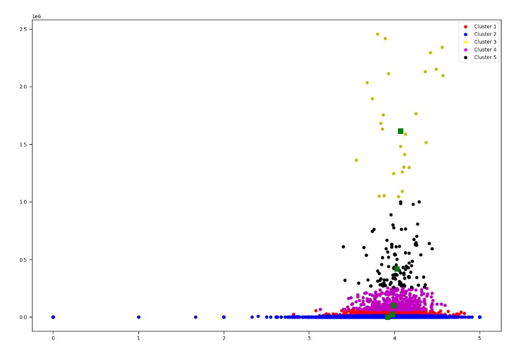

# Machine Learning On Dataset Of Books

## About the project

The purpose of this project is to learn how to work with data frames and execute some 
 **Machine Learning** algorithms.

The data of the books is taken from a dataset of books. The file *books.csv* include the data.

This is still an **ongoing project**.

## About the dataset

The dataset contains information of more than 45,000 books. every book has information like **the number of pages, publication date, average rating,
the total amount of ratings** and more

## Examples of ML algorithms that I used

### KNN algorithm
### `getClosestBooks()`
Given a number N and a book of a name in the database,
                       return a list of N most similar books (with respect to the given book) on the database.

### K-means and PCA
### `booksDistributionCluster()`
The function takes the important information of the books (number of pages, rating..) and reduces the dimension of this
information to a 2-D, and does a k-mean clustering. the number of clusters determined by 
the Elbow Method algorithm.

## Some more functionalities

### function that shows the corrolation between two features, for example, the number of pages and average rating.

### clustering the correlation between rating count and average rating, and dealing with outliers.

### some more little stuff that i did, like:

1) Create a "score" column according to some scoring function that i built
2) working with matplotlib
3) working with data frames

