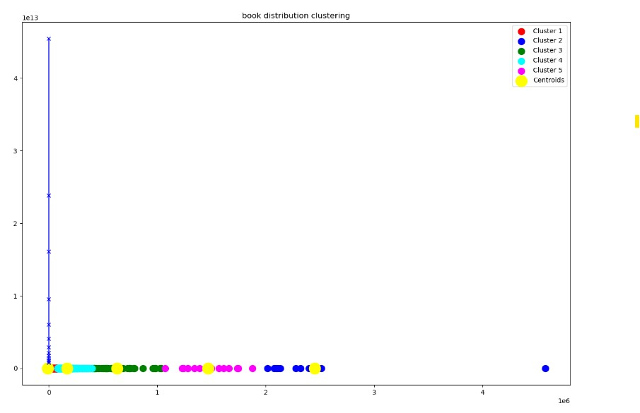
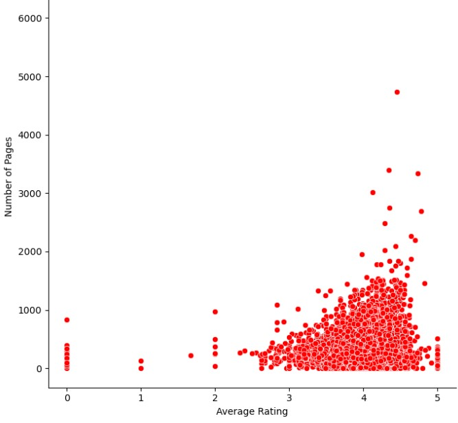

# Book Recommendation Project

## About the project

The purpose of this project is to create a book recommendation system
using **Machine Learning** algorithms.

The data of the books is took from a dataset of books. The file *books.csv* include the data.

This is still **ongoing project**.

## About the dataset

The dataset contain information of more than 45,000 books. every book have information like **number of pages, publication date, average rating,
total amount of rating** and more

## Example of ML algorithms that i used

### KNN algorithm
### `getClosestBooks()`
Given a number N and a book of a name in the database,
                       return list of N most similar books (with respect to the given book) on the database.

### K-means and PCA
### `booksDistributionCluster()`
The function take the importent information of the books (number of pages, rating..) and reduce the dimention of this
information to a 2-D, and does a k-mean clusting. the number of cluster determined by 
the Elbow Method algorithm.

## Some more functionalities

### function that showing the corrolation between two features, for example number of pages and average rating.

### clusting the correlation between rating count and average rating, and dealing with outliers.

